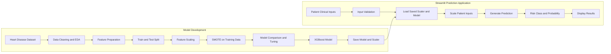

# Heart Disease Risk Prediction

A machine learning web application that estimates heart disease risk from patient clinical information, with a recall-focused evaluation strategy designed to reduce false-negative predictions.


---

## Overview

Heart Disease Risk Prediction is an end-to-end machine learning application that estimates heart disease risk using patient clinical information.

The project focuses not only on achieving strong overall classification performance, but also on improving recall and reducing false-negative predictions.

A false negative occurs when the model predicts a negative result for a patient who belongs to the positive class. Because missing a potentially positive case may be more concerning in a health-risk screening scenario, recall was treated as an important evaluation metric during model development.

The final XGBoost model is integrated into an interactive Streamlit application that provides:

- A heart disease risk prediction
- A probability-based result
- A clear interpretation of the model output
- Model performance information
- An accessible interface for non-technical users

---

## Important Disclaimer

> [!WARNING]
> This project was created for educational and portfolio purposes.
>
> It is not a medical device, does not provide a clinical diagnosis, and must not be used as a substitute for professional medical evaluation, testing, treatment, or advice.
>
> Model predictions may be incorrect and should not be used to make healthcare decisions.

---

## Key Features

- Interactive Streamlit web application
- Patient clinical-information input form
- Heart disease risk classification
- Probability-based prediction output
- XGBoost classification model
- Comparison of multiple machine learning models
- Recall-focused model evaluation
- False-negative reduction objective
- Data cleaning and preprocessing
- Exploratory data analysis
- Feature engineering
- Numerical feature scaling
- Class-imbalance handling using SMOTE
- Hyperparameter tuning
- Model performance visualization
- Saved-model loading using Joblib
- Clean and user-friendly interface
- Separate model-training script
- Reusable saved scaler and trained model

---

## Live Demo

The deployed Streamlit application is available at:

[Open the Heart Disease Risk Prediction App](https://ai-heart-risk-detector.streamlit.app/)

---

## Demo Workflow

1. Enter the requested patient clinical information.
2. Submit the values through the Streamlit interface.
3. Validate and scale the inputs using the saved preprocessing scaler.
4. Generate a prediction using the trained XGBoost model.
5. Display the predicted risk class and model probability.

```text
Patient Inputs → Validation and Scaling → XGBoost Prediction → Risk Class and Probability → Streamlit Result
```

---

## System Architecture



---

## Machine Learning Workflow

### 1. Data Cleaning

The dataset is inspected and prepared before model development.

The cleaning stage ensures that the available clinical variables can be processed consistently throughout the machine learning pipeline.

### 2. Exploratory Data Analysis

Exploratory analysis is used to understand:

- Feature distributions
- Target-class distribution
- Relationships between clinical variables
- Potential data-quality issues
- Patterns associated with heart disease risk
- Possible class imbalance

### 3. Feature Engineering

The available patient variables are prepared and transformed into model-ready features.

This stage ensures that the same feature representation is used during both model training and application inference.

### 4. Train and Test Split

The dataset is separated into training and evaluation portions.

The training data is used to fit the preprocessing and classification pipeline, while the held-out data is used to evaluate model performance.

### 5. Feature Scaling

Numerical variables are scaled before model training.

The fitted scaler is saved as:

```text
scaler.joblib
```

The Streamlit application loads the same scaler and applies it to new patient inputs before generating predictions.

### 6. Class Balancing

SMOTE is used during model development to address class imbalance in the training data.

SMOTE creates synthetic examples for the minority class to help the model learn patterns associated with less-represented cases.

Resampling should be applied only to the training portion of the data to reduce the risk of data leakage.

### 7. Model Comparison

Multiple machine learning classification models are trained and evaluated.

The comparison considers several classification metrics rather than relying only on accuracy.

### 8. Hyperparameter Tuning

Model parameters are adjusted to improve classification performance and support the recall-focused objective.

### 9. Model Evaluation

The final model is evaluated using:

- Accuracy
- Precision
- Recall
- F1 Score

Recall receives particular attention because it measures the proportion of positive cases correctly identified by the model.

### 10. Model Deployment

The selected model and scaler are saved using Joblib and integrated into the Streamlit application.

The saved files are:

```text
heart_model.joblib
scaler.joblib
```

---

## Classification Objective

The application performs a binary classification task.

```text
Input:
Patient clinical information

Output:
Heart disease risk classification
and model probability
```

The application processes the patient values using the saved scaler and generates a prediction using the trained classification model.

The displayed probability is a machine learning model output. It should not be interpreted as a clinically validated probability of developing heart disease.

---

## Final Model

The deployed model is:

```text
XGBoost Classifier
```

XGBoost is a gradient-boosted decision-tree algorithm that combines multiple sequential decision trees to generate the final prediction.

The model was selected and optimized with an emphasis on:

- Improving recall
- Reducing false negatives
- Maintaining strong overall classification performance
- Producing probability-based predictions

The trained model is stored in:

```text
heart_model.joblib
```

---

## Reported Model Performance

The project reports the following evaluation results:

| Metric | Result |
|---|---:|
| Accuracy | 98.54% |
| Precision | 100.00% |
| Recall | 97.09% |
| F1 Score | 98.52% |

These values represent the reported performance from the project’s model-evaluation process.

They should not be interpreted as evidence of clinical effectiveness or guaranteed real-world performance.

---

## Evaluation Metrics

### Accuracy

Accuracy measures the proportion of all predictions that were classified correctly.

```text
Accuracy =
Correct Predictions / Total Predictions
```

### Precision

Precision measures how often positive predictions were correct.

```text
Precision =
True Positives / (True Positives + False Positives)
```

### Recall

Recall measures how many actual positive cases were correctly identified.

```text
Recall =
True Positives / (True Positives + False Negatives)
```

The reported recall of `97.09%` means that approximately 97.09% of positive cases in the evaluation data were identified by the model.

### F1 Score

The F1 Score balances precision and recall using their harmonic mean.

```text
F1 =
2 × (Precision × Recall) / (Precision + Recall)
```

---

## Recall-Focused Optimization

Accuracy alone may hide poor performance on an important class, especially when the dataset is imbalanced.

This project gives additional attention to recall because recall is directly affected by false-negative predictions.

The recall-focused strategy includes:

- Inspecting the target-class distribution
- Applying SMOTE to the training data
- Comparing multiple classification algorithms
- Monitoring false-negative predictions
- Tuning model hyperparameters
- Considering recall during model selection
- Reporting precision and F1 Score alongside accuracy

The objective is to reduce the number of positive cases incorrectly classified as negative while maintaining useful overall performance.

---

## Confusion Matrix

A binary classification confusion matrix contains four possible outcomes:

| Actual Class | Predicted Negative | Predicted Positive |
|---|---:|---:|
| Actual Negative | True Negative | False Positive |
| Actual Positive | False Negative | True Positive |

For this project, false negatives are especially important.

A false negative occurs when:

```text
Actual class: Positive
Predicted class: Negative
```

Reducing false negatives increases recall.

---

## Tech Stack

| Category | Technology |
|---|---|
| Programming language | Python |
| User interface | Streamlit |
| Machine learning | Scikit-learn |
| Final classifier | XGBoost |
| Data processing | Pandas |
| Numerical operations | NumPy |
| Class balancing | SMOTE |
| Model persistence | Joblib |
| Analysis environment | Jupyter Notebook |
| Dataset format | CSV |
| Deployment | Streamlit Community Cloud |

---

## Project Structure

```text
heart-disease-prediction/
├── .devcontainer/
├── app.py
├── heart_disease_model_selection_analysis.ipynb
├── heart_model.joblib
├── heart.csv
├── requirements.txt
├── scaler.joblib
└── train_model.py
```

### Main Files

| File | Purpose |
|---|---|
| `app.py` | Streamlit user interface and prediction workflow |
| `train_model.py` | Model training, preprocessing, and artifact generation |
| `heart_disease_model_selection_analysis.ipynb` | Data analysis, model comparison, and experimentation |
| `heart_model.joblib` | Saved trained classification model |
| `scaler.joblib` | Saved feature scaler |
| `heart.csv` | Heart disease dataset |
| `requirements.txt` | Python dependencies |
| `.devcontainer/` | Development-container configuration |

---

## Installation

### 1. Clone the Repository

```bash
git clone https://github.com/Azoqoz/heart-disease-risk-prediction.git
cd heart-disease-risk-prediction
```

### 2. Create a Virtual Environment

#### Windows

```powershell
python -m venv .venv
.venv\Scripts\activate
```

#### macOS / Linux

```bash
python3 -m venv .venv
source .venv/bin/activate
```

### 3. Install the Dependencies

```bash
pip install -r requirements.txt
```

No external API key or paid service is required to run the application.

---

## Running the Application

Start the Streamlit application using:

```bash
streamlit run app.py
```

Streamlit will display a local URL in the terminal, typically:

```text
http://localhost:8501
```

Open the displayed URL in your browser.

---

## Training the Model

To retrain the model using the included training script, run:

```bash
python train_model.py
```

The training script is responsible for generating or updating the saved model artifacts:

```text
heart_model.joblib
scaler.joblib
```

After retraining, restart the Streamlit application so that it loads the updated files.

---

## Model Analysis Notebook

The repository includes the following notebook:

```text
heart_disease_model_selection_analysis.ipynb
```

The notebook contains the project’s machine learning experimentation and analysis workflow, including:

- Dataset exploration
- Data preprocessing
- Model comparison
- Classification evaluation
- Model-selection analysis

Open the notebook using Jupyter Notebook, JupyterLab, or the VS Code notebook interface.

---

## Deployment

The application is deployed using Streamlit Community Cloud.

Live application:

[https://ai-heart-risk-detector.streamlit.app/](https://ai-heart-risk-detector.streamlit.app/)

Recommended Streamlit deployment settings:

```text
Repository: Azoqoz/heart-disease-risk-prediction
Branch: main
Main file path: app.py
```

The deployed application loads:

```text
heart_model.joblib
scaler.joblib
```

No API keys or Streamlit secrets are required.

---

## Current Limitations

- The model is not clinically validated
- The application is not a medical diagnostic tool
- Reported performance may depend on the selected dataset and evaluation split
- Strong performance on one test set does not guarantee equivalent real-world performance
- SMOTE-generated examples are synthetic and may not represent real patients
- Prediction probabilities are model outputs rather than clinically validated disease probabilities
- The model may perform differently across demographic or clinical subgroups
- The application does not include laboratory testing or physician assessment
- The application does not provide treatment recommendations
- Dataset bias may affect model predictions
- The project does not include external clinical validation
- The interface does not provide production healthcare privacy or governance controls
- The system should not be used for medical decision-making

---

## Future Improvements

- Add external validation using an independent dataset
- Add stratified cross-validation
- Add probability-calibration analysis
- Add ROC-AUC reporting
- Add Precision-Recall curve reporting
- Add confusion-matrix visualization
- Add threshold selection based on recall and false-negative cost
- Add subgroup performance analysis
- Add SHAP-based model explanations
- Add automated data-validation tests
- Add model-version tracking
- Add experiment tracking
- Add model-drift monitoring
- Add unit and integration tests
- Add Docker support
- Add continuous integration
- Add a secured prediction API
- Add stronger privacy and access controls
- Add medically reviewed user guidance
- Add formal clinical and regulatory validation before any healthcare use

---

## Why This Project Matters

This project demonstrates an end-to-end machine learning classification workflow rather than only presenting a trained model inside a notebook.

It covers practical machine learning and application-development skills, including:

- Data cleaning
- Exploratory data analysis
- Feature engineering
- Feature scaling
- Imbalanced-class handling
- SMOTE integration
- Classification model comparison
- Hyperparameter tuning
- Evaluation using multiple metrics
- Recall-focused model selection
- False-negative analysis
- XGBoost model development
- Model persistence
- Probability-based prediction
- Streamlit application development
- Cloud deployment
- Responsible communication of model limitations

The project also demonstrates why metric selection should reflect the consequences of classification errors rather than relying only on overall accuracy.

---

## Author

Developed by [Azoqoz](https://github.com/Azoqoz).
