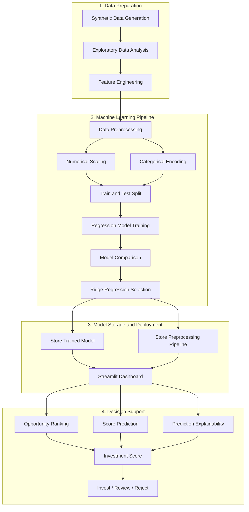

# AI Investment Opportunity Analyzer

A machine learning decision-support dashboard for evaluating synthetic investment opportunities, estimating an Investment Score from 0 to 100, and classifying each opportunity as Invest, Review, or Reject.


---

## Overview

AI Investment Opportunity Analyzer is an end-to-end machine learning application that simulates how investment opportunities can be evaluated through a structured scoring and recommendation workflow.

The system analyzes financial, market, strategic, risk, sustainability, sector, and regional factors to estimate an Investment Score between 0 and 100.

The predicted score is converted into one of three recommendation categories:

- **Invest**
- **Review**
- **Reject**

The project covers the complete machine learning lifecycle, including synthetic data generation, exploratory data analysis, feature engineering, preprocessing, model comparison, explainability, prediction, and interactive dashboard development.

---

## Important Disclaimer

> [!WARNING]
> This project uses a fully synthetic dataset created for educational and portfolio purposes.
>
> It does not use real investment data and must not be treated as financial advice or used for real investment decisions without validated data, domain-expert review, governance, and additional testing.

---

## Key Features

- Generate a synthetic investment-opportunity dataset
- Analyze 5,000 synthetic opportunity records
- Explore opportunities across multiple sectors and regions
- Calculate an Investment Score from 0 to 100
- Classify opportunities as Invest, Review, or Reject
- Compare multiple regression algorithms
- Select the best-performing model using Mean Absolute Error
- Preprocess numerical and categorical features
- Scale numerical variables with StandardScaler
- Encode categorical variables with OneHotEncoder
- Create financial, market, strategic, sustainability, and risk features
- Rank existing opportunities using configurable filters
- Inspect individual opportunities and their decision factors
- Predict scores for new opportunity profiles
- Convert simplified user inputs into model-ready features
- Explain predictions through feature contributions
- Display model results and analytics in an interactive Streamlit dashboard
- Persist the trained model and preprocessing pipeline using Joblib

---

## Demo Workflow

The dashboard contains five main sections.

### 1. Overview

Review high-level information such as:

- Total number of opportunities
- Average Investment Score
- Average risk level
- Number of Invest recommendations
- Recommendation distribution
- Investment-score distribution
- Average scores by sector
- Average scores by region

### 2. Opportunity Ranking

Filter and rank existing opportunities using:

- Sector
- Region
- Recommendation
- Investment Score range
- Number of results to display

The opportunities are ranked using Investment Score, expected ROI, and overall risk.

### 3. Analyze Existing Opportunity

Select an existing opportunity and review:

- Investment Score
- Recommendation
- Expected ROI
- Overall risk
- Sector and region
- Investment size
- Payback period
- Profit margin
- Financial strength
- Market attractiveness
- Strategic impact
- Sustainability

### 4. Predict New Opportunity

Enter a simplified opportunity profile using:

- Sector
- Region
- Competition level
- Investment size
- Expected ROI
- Payback period
- Market demand
- Overall risk
- Strategic alignment
- Sustainability and ESG potential

The application converts these inputs into the complete model feature set before generating the score and recommendation.

### 5. Methodology

Review:

- Machine learning workflow
- Target variable
- Selected model
- Recommendation thresholds
- Model-comparison results
- Mean Absolute Error visualization
- Project limitations and disclaimer

---

## System Architecture



---

## Machine Learning Workflow

### 1. Synthetic Data Generation

The project generates 5,000 synthetic investment-opportunity records.

The dataset includes information related to:

- Financial performance
- Investment size
- Capital and operating costs
- Expected ROI
- Internal rate of return
- Net present value
- Payback period
- Market size and growth
- Customer demand and adoption
- Strategic alignment
- Risk indicators
- Sustainability and ESG
- Sector
- Region
- Competition level

### 2. Exploratory Data Analysis

The dataset is explored through:

- Summary statistics
- Investment-score distributions
- Recommendation distributions
- Sector comparisons
- Region comparisons
- Correlation analysis
- Risk-versus-score comparisons
- ROI-versus-score comparisons
- Strategic-impact analysis

### 3. Feature Engineering

The project creates additional decision-support features, including:

- Overall risk score
- Strategic impact score
- Sustainability score
- Market attractiveness score
- Financial strength score
- Risk-adjusted ROI
- Profitability index
- Payback efficiency

### 4. Data Preprocessing

Numerical features are standardized using:

```text
StandardScaler
```

Categorical features are encoded using:

```text
OneHotEncoder
```

The transformations are stored in a fitted preprocessing pipeline and reused during inference.

### 5. Model Training

The machine learning task is formulated as a regression problem.

The target variable is:

```text
Investment Score: 0–100
```

Multiple regression algorithms are trained and compared.

### 6. Model Evaluation

The models are evaluated using:

- Mean Absolute Error
- Root Mean Squared Error
- R² Score

The model with the lowest Mean Absolute Error is selected.

### 7. Prediction

The selected model predicts an Investment Score, which is limited to remain between 0 and 100.

### 8. Recommendation Generation

The predicted score is converted into an Invest, Review, or Reject recommendation.

### 9. Explainability

For each prediction, the application calculates feature contributions using the processed feature values and the Ridge Regression coefficients.

This allows the dashboard to display which factors increased or decreased the predicted Investment Score.

---

## Models Compared

The following regression models were evaluated:

- Linear Regression
- Ridge Regression
- Random Forest Regressor
- Gradient Boosting Regressor
- Extra Trees Regressor

The recorded model-comparison results are:

| Model | MAE | RMSE | R² |
|---|---:|---:|---:|
| Ridge Regression | 7.3260 | 9.3381 | 0.8394 |
| Linear Regression | 7.3466 | 9.3661 | 0.8384 |
| Gradient Boosting | 8.0693 | 10.1460 | 0.8104 |
| Extra Trees | 8.7917 | 11.0306 | 0.7759 |
| Random Forest | 8.8311 | 11.0148 | 0.7765 |

---

## Selected Model

The selected model is:

```text
Ridge Regression
```

Ridge Regression achieved the lowest Mean Absolute Error in the recorded model comparison:

```text
MAE  = 7.3260
RMSE = 9.3381
R²   = 0.8394
```

Ridge Regression also supports coefficient-based feature contribution analysis, allowing the application to explain the direction and approximate impact of individual processed features.

---

## Recommendation Logic

The predicted Investment Score is mapped to a recommendation using the following thresholds:

| Score Range | Recommendation |
|---|---|
| 75–100 | Invest |
| 45–74.99 | Review |
| Below 45 | Reject |

The implemented logic is:

```python
if score >= 75:
    recommendation = "Invest"
elif score >= 45:
    recommendation = "Review"
else:
    recommendation = "Reject"
```

These thresholds are project-defined decision rules created for the synthetic portfolio scenario. They are not validated financial standards.

---

## Prediction Explainability

The application explains Ridge Regression predictions using local feature contributions.

For each processed feature:

```text
Feature Contribution =
Processed Feature Value × Model Coefficient
```

Positive contributions increase the predicted Investment Score, while negative contributions reduce it.

The dashboard displays:

- Top contributing features
- Positive score drivers
- Negative score drivers
- Contribution direction
- Contribution magnitude
- Feature-contribution visualization

This provides a more transparent prediction experience than displaying a score without supporting information.

---

## Tech Stack

| Category | Technology |
|---|---|
| Programming language | Python |
| User interface | Streamlit |
| Machine learning | Scikit-learn |
| Selected model | Ridge Regression |
| Data processing | Pandas |
| Numerical operations | NumPy |
| Interactive visualization | Plotly |
| Analysis visualization | Matplotlib and Seaborn |
| Preprocessing | StandardScaler and OneHotEncoder |
| Model persistence | Joblib |
| Experiments | Jupyter Notebook |
| Data format | CSV |

---

## Project Structure

```text
ai-investment-opportunity-analyzer/
├── app/
│   └── streamlit_app.py
│
├── config/
│
├── data/
│   ├── raw/
│   │   └── synthetic_investment_opportunities.csv
│   │
│   └── processed/
│       ├── X_test_processed.csv
│       ├── X_train_processed.csv
│       ├── y_test.csv
│       └── y_train.csv
│
├── models/
│   ├── best_model.pkl
│   ├── model_metadata.json
│   └── preprocessor.pkl
│
├── notebooks/
│   ├── 01_data_generation.ipynb
│   ├── 02_eda.ipynb
│   ├── 03_preprocessing_feature_engineering.ipynb
│   ├── 04_model_training_comparison.ipynb
│   ├── 05_explainability.ipynb
│   └── 06_final_pipeline_test.ipynb
│
├── reports/
│   ├── figures/
│   ├── feature_importance.csv
│   ├── local_explanation_example.csv
│   ├── model_comparison_results.csv
│   ├── recommendation_summary.csv
│   ├── region_score_summary.csv
│   ├── score_correlations.csv
│   ├── sector_score_summary.csv
│   ├── test_predictions.csv
│   └── top_10_opportunities.csv
│
├── src/
│   ├── __pycache__/
│   ├── explanations.py
│   ├── predict.py
│   └── scoring.py
│
├── tests/
├── .gitignore
├── deployment_notes.md
├── README.md
└── requirements.txt
```

---

## Installation

### 1. Clone the Repository

```bash
git clone https://github.com/Azoqoz/ai-investment-opportunity-analyzer.git
cd ai-investment-opportunity-analyzer
```

### 2. Create a Virtual Environment

#### Windows

```powershell
python -m venv .venv
.venv\Scripts\activate
```

#### macOS / Linux

```bash
python3 -m venv .venv
source .venv/bin/activate
```

### 3. Install the Dependencies

```bash
pip install -r requirements.txt
```

No external API key or paid service is required to run the application.

---

## Running the Application

Start the Streamlit dashboard using:

```bash
streamlit run app/streamlit_app.py
```

Streamlit will display a local URL in the terminal, typically:

```text
http://localhost:8501
```

Open the displayed URL in your browser.

---

## Reproducing the Machine Learning Workflow

The notebooks are organized in execution order.

Run them sequentially:

```text
01_data_generation.ipynb
02_eda.ipynb
03_preprocessing_feature_engineering.ipynb
04_model_training_comparison.ipynb
05_explainability.ipynb
06_final_pipeline_test.ipynb
```

This workflow reproduces:

1. Synthetic data generation
2. Exploratory data analysis
3. Data preprocessing
4. Feature engineering
5. Model training
6. Model comparison
7. Best-model selection
8. Explainability outputs
9. Final prediction-pipeline validation

The trained model and preprocessor are stored in:

```text
models/best_model.pkl
models/preprocessor.pkl
```

---

## Deployment

The application can be deployed using Streamlit Community Cloud.

Recommended deployment settings:

```text
Repository: Azoqoz/ai-investment-opportunity-analyzer
Branch: main
Main file path: app/streamlit_app.py
```

The application does not require API keys or Streamlit secrets.

The dataset, trained model, preprocessing pipeline, and model-comparison results are loaded directly from the repository.

---

## Screenshots and Results

### Model Comparison


### Actual vs. Predicted Scores


### Investment Score Distribution


### Feature Importance


### Local Prediction Explanation


---

## Current Limitations

- The dataset is entirely synthetic
- The model has not been validated using real investment outcomes
- Recommendation thresholds are manually defined project rules
- The model may reproduce assumptions embedded in the synthetic data-generation process
- Simplified dashboard inputs generate additional model features using predefined mappings, formulas, medians, and modes
- Coefficient-based explanations describe the Ridge Regression model but do not establish causation
- The dashboard does not include real-time financial or market data
- The application does not include authentication or saved user sessions
- The current results do not demonstrate performance on a real production distribution
- The system should not replace financial analysis, due diligence, or expert judgment

---

## Future Improvements

- Train and validate the system using a governed real-world dataset
- Add cross-validation and systematic hyperparameter tuning
- Add SHAP-based global and local explanations
- Add model and dataset versioning
- Add experiment tracking
- Add automated unit and integration tests
- Add data-validation checks
- Add model-drift and data-drift monitoring
- Add scenario comparison between multiple opportunities
- Add downloadable analysis reports
- Add a REST API for external integrations
- Add user authentication and saved analysis sessions
- Add Docker support
- Add continuous integration and automated deployment
- Add external market-data integrations
- Add human approval and governance workflows

---

## Why This Project Matters

This project demonstrates a complete applied machine learning workflow rather than only presenting a trained notebook model.

It covers practical skills including:

- Synthetic data generation
- Exploratory data analysis
- Feature engineering
- Numerical and categorical preprocessing
- Regression model development
- Model evaluation and comparison
- Model selection
- Prediction-pipeline construction
- Model persistence
- Explainable machine learning
- Decision-rule implementation
- Interactive analytics
- Streamlit dashboard development
- Cloud deployment preparation
- User-focused presentation of technical outputs

The project shows how a machine learning model can be transformed into a usable decision-support application while clearly communicating its assumptions and limitations.

---

## Author

Developed by [Azoqoz](https://github.com/Azoqoz).
